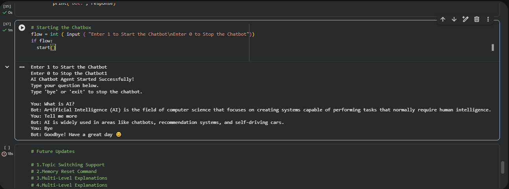

# AI Chatbot Using Agentic AI and Basic NLP

This project is an AI-based chatbot developed using **Python**, **basic Natural Language Processing (NLP)**, and an **agentic AI design approach**.  
It was built as part of the **IBM SkillBuild Winter Internship** to demonstrate how intelligent agents can be created using rule-based logic, intent detection, and contextual memory.

---

## 🚀 Project Overview

The chatbot is designed to help users quickly understand fundamental AI concepts through conversational interaction.  
Unlike simple keyword-based bots, this chatbot maintains **context awareness**, allowing it to handle **follow-up questions** intelligently.

The focus of this project is on **core AI logic and system design**, without using external AI APIs or pretrained models.

---

## 🧠 Key Features

- **Intent Detection**
  - Identifies what the user wants (Greeting, Definition, Follow-up, Exit, Unknown)

- **Topic Detection**
  - Detects AI-related topics such as:
    - Artificial Intelligence (AI)
    - Machine Learning (ML)
    - Deep Learning (DL)
    - Neural Networks (NN)

- **Context Memory**
  - Stores the last discussed topic and intent
  - Enables follow-up questions like *“Tell me more”*

- **Agentic Decision Logic**
  - Combines intent, topic, and memory to generate appropriate responses

- **Exit Handling**
  - Allows users to gracefully end the conversation

---

## 🏗️ System Architecture (High Level)

1. User enters a text query  
2. Input is normalized using basic NLP  
3. Intent is detected  
4. Topic is identified (or retrieved from memory)  
5. Context memory is updated  
6. Response is generated based on decision logic  

This workflow simulates **agent-based intelligent behavior**.

---

## 🛠️ Tools & Technologies

- **Programming Language:** Python  
- **Development Environment:** Google Colab / Local Python  
- **AI Approach:** Rule-Based NLP  
- **Design Concept:** Agentic AI (Intent + Topic + Memory)

---

## 💬 Sample Interaction

# AI Chatbot Using Agentic AI and Basic NLP

This project is an AI-based chatbot developed using **Python**, **basic Natural Language Processing (NLP)**, and an **agentic AI design approach**.  
It was built as part of the **IBM SkillBuild Winter Internship** to demonstrate how intelligent agents can be created using rule-based logic, intent detection, and contextual memory.

---

## 🚀 Project Overview

The chatbot is designed to help users quickly understand fundamental AI concepts through conversational interaction.  
Unlike simple keyword-based bots, this chatbot maintains **context awareness**, allowing it to handle **follow-up questions** intelligently.

The focus of this project is on **core AI logic and system design**, without using external AI APIs or pretrained models.

---

## 🧠 Key Features

- **Intent Detection**
  - Identifies what the user wants (Greeting, Definition, Follow-up, Exit, Unknown)

- **Topic Detection**
  - Detects AI-related topics such as:
    - Artificial Intelligence (AI)
    - Machine Learning (ML)
    - Deep Learning (DL)
    - Neural Networks (NN)

- **Context Memory**
  - Stores the last discussed topic and intent
  - Enables follow-up questions like *“Tell me more”*

- **Agentic Decision Logic**
  - Combines intent, topic, and memory to generate appropriate responses

- **Exit Handling**
  - Allows users to gracefully end the conversation

---

## 🏗️ System Architecture (High Level)

1. User enters a text query  
2. Input is normalized using basic NLP  
3. Intent is detected  
4. Topic is identified (or retrieved from memory)  
5. Context memory is updated  
6. Response is generated based on decision logic  

This workflow simulates **agent-based intelligent behavior**.

---

## 🛠️ Tools & Technologies

- **Programming Language:** Python  
- **Development Environment:** Google Colab / Local Python  
- **AI Approach:** Rule-Based NLP  
- **Design Concept:** Agentic AI (Intent + Topic + Memory)

---

## 💬 Sample Interaction

This demonstrates **context-aware conversation handling**.

---

## 📚 Learnings & Skills Gained

- Understanding of NLP fundamentals  
- Designing rule-based AI systems  
- Implementing intent and topic detection  
- Managing conversational context using memory  
- Writing clean and modular Python code  

---

## 🔮 Future Enhancements

- Topic switching within a conversation  
- Memory reset command  
- Support for additional AI domains  
- Web-based or GUI interface  
- Improved NLP using advanced techniques  

---

## 👤 Author

**Ankush Poonia**  
B.Tech Computer Science (AI)  
IBM SkillBuild Winter Internship  

---

## 📌 Note

This project represents **Version 1.0** and is intended to be upgraded gradually as part of a long-term learning and portfolio initiative.
