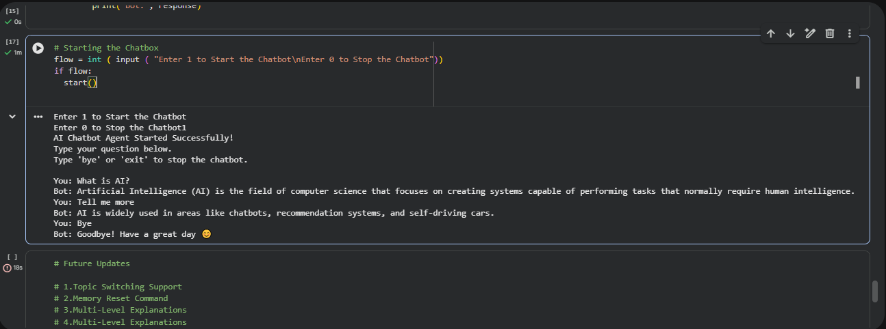

# 🤖 AI Chatbot using Agentic AI & Basic NLP

<div align="center">


**An intelligent, context-aware AI chatbot demonstrating agentic behavior through rule-based NLP**

Developed during **IBM SkillBuild Winter Internship**

[Features](#-key-features) • [Architecture](#-agent-architecture--workflow) • [Demo](#-sample-interactions) • [Installation](#-installation--usage) • [Roadmap](#-roadmap)

</div>

---

## 📌 Project Overview

This project is a **context-aware AI Chatbot** built using Python and rule-based NLP, designed to demonstrate **agentic behavior** rather than simple if-else responses.

Unlike traditional chatbots that give static responses, this agent:
- ✅ **Understands user intent** through intelligent detection
- ✅ **Maintains conversation context** across multiple exchanges
- ✅ **Handles follow-up questions** naturally
- ✅ **Adjusts explanation depth** (BASIC ↔ DETAILED)
- ✅ **Switches topics** seamlessly mid-conversation
- ✅ **Responds intelligently** using memory and decision logic

This project evolved iteratively from a basic chatbot (V1) into a **stateful AI agent** (V2), demonstrating real-world AI system design principles.

---

## 🎯 Problem Statement

Students and beginners often need quick, clear explanations of fundamental AI concepts:
- Artificial Intelligence (AI)
- Machine Learning (ML)
- Deep Learning (DL)
- Neural Networks (NN)

**Most basic chatbots fail to:**
- ❌ Handle follow-up questions intelligently
- ❌ Maintain conversation context
- ❌ Adjust explanation depth based on user needs
- ❌ Switch topics naturally

**This project addresses those gaps** by implementing agent-like behavior with minimal dependencies.

---

## 🧠 Key Features

### 🎯 **Multi-Level Explanation Control**
- **BASIC mode:** Simple, beginner-friendly explanations
- **DETAILED mode:** Technical and structured in-depth content
- Dynamically adjusts based on user request or maintains from memory

### 🔍 **Advanced Intent Detection**
Supported intents with priority-based resolution:
```
EXIT > RESET > GREETING > ASK_DEFINITION > FOLLOW_UP > UNKNOWN
```
- `GREETING` - User greets the chatbot
- `ASK_DEFINITION` - User requests explanation of a topic
- `FOLLOW_UP` - User asks continuation questions ("tell me more")
- `RESET` - User wants to clear conversation memory
- `EXIT` - User wants to end the session
- `UNKNOWN` - Fallback with helpful clarification

### 🧩 **Smart Topic Detection**
Identifies and tracks AI-related topics:
- **AI** - Artificial Intelligence
- **ML** - Machine Learning
- **DL** - Deep Learning
- **NN** - Neural Networks

Supports seamless **topic switching** within conversations.

### 🧠 **Context Memory (Agent State)**
Maintains persistent memory across conversation:
```python
memory = {
    "last_topic": None,    # Current discussion topic
    "last_intent": None,   # Previous user intent
    "last_depth": None     # Explanation depth (BASIC/DETAILED)
}
```

This enables:
- Context-aware responses
- Intelligent follow-up handling
- Agent-like conversation continuity

### 🔄 **Topic Switching Support**
Users can naturally switch topics mid-conversation:
```
"Explain AI" → "Now tell me about Machine Learning"
```
The agent detects the change and adapts context safely.

### 🔧 **Memory Reset & Exit Handling**
- **Memory reset** with confirmation prompt to prevent accidental loss
- **Clean exit** that resets state and provides friendly goodbye
- Graceful session termination

### ❓ **Robust Unknown Intent Handling**
When the chatbot cannot understand a query:
- Asks for clarification
- Suggests supported topics
- Avoids confusing or misleading responses
- Maintains helpful and friendly tone

---

## 🗂️ Agent Architecture & Workflow

### High-Level Decision Flow

```
┌─────────────────────────────────────────────────────────────┐
│                     USER INPUT RECEIVED                      │
└─────────────────────┬───────────────────────────────────────┘
                      │
                      ▼
┌─────────────────────────────────────────────────────────────┐
│              STEP 1: Input Normalization (NLP)              │
│              • Lowercase conversion                          │
│              • Whitespace trimming                           │
└─────────────────────┬───────────────────────────────────────┘
                      │
                      ▼
┌─────────────────────────────────────────────────────────────┐
│              STEP 2: Intent Detection                        │
│              • Priority-based keyword matching               │
│              • EXIT > RESET > GREETING > ASK > FOLLOW > ?    │
└─────────────────────┬───────────────────────────────────────┘
                      │
                      ▼
┌─────────────────────────────────────────────────────────────┐
│              STEP 3: Topic Identification                    │
│              • Keyword-based topic detection                 │
│              • Fallback to memory if not found               │
└─────────────────────┬───────────────────────────────────────┘
                      │
                      ▼
┌─────────────────────────────────────────────────────────────┐
│              STEP 4: Depth Resolution                        │
│              • Check for explicit depth keywords             │
│              • Retrieve from memory or use default           │
└─────────────────────┬───────────────────────────────────────┘
                      │
                      ▼
┌─────────────────────────────────────────────────────────────┐
│              STEP 5: Memory Update                           │
│              • Store current topic, intent, depth            │
│              • Enable context for next interaction           │
└─────────────────────┬───────────────────────────────────────┘
                      │
                      ▼
┌─────────────────────────────────────────────────────────────┐
│              STEP 6: Response Generation                     │
│              • Use intent + topic + depth + memory           │
│              • Generate contextually appropriate reply        │
└─────────────────────┬───────────────────────────────────────┘
                      │
                      ▼
┌─────────────────────────────────────────────────────────────┐
│                    DISPLAY TO USER                           │
│                    Loop continues until EXIT                 │
└─────────────────────────────────────────────────────────────┘
```

This workflow simulates **true agent-based intelligent behavior** with stateful context management.

---

## 💬 Sample Interactions

### 📸 Example 1: Basic Conversation Flow with Context Memory



**Demonstrates:**
- Clear, beginner-friendly definitions
- Natural follow-up question handling ("tell me more")
- Context maintenance across exchanges
- Smooth conversation flow

---

### 📸 Example 2: Multi-Level Explanations & Topic Switching


**Demonstrates:**
- **Detailed explanation mode** when explicitly requested
- **Topic switching** capability (AI → ML)
- **Context-aware responses** referencing previous discussion
- **Graceful handling** of unclear or unsupported requests
- **Unknown intent** fallback with helpful guidance

---

## 🚀 Version History

### ✅ Version 2.0 (Current - Completed)

**Major Features:**
- ✨ Multi-level explanation control (BASIC/DETAILED)
- ✨ Enhanced context memory with depth tracking
- ✨ Full topic switching support
- ✨ Memory reset functionality with confirmation
- ✨ Robust unknown intent handling
- ✨ Improved agentic workflow and decision logic

**Technical Improvements:**
- Advanced state management
- Priority-based intent resolution
- Depth policy implementation
- Graceful error handling

---

### ✅ Version 1.0

**Initial Features:**
- Basic intent detection (Greeting, Definition, Follow-up, Exit)
- Topic identification (AI/ML/DL/NN)
- Simple context memory
- Basic follow-up handling
- Keyword-based responses

---

## 📊 Version Comparison

| Feature | Version 1.0 | Version 2.0 |
|---------|-------------|-------------|
| **Explanation Depth** | Single level only | Multi-level (BASIC/DETAILED) |
| **Topic Switching** | Limited support | Full seamless support |
| **Memory Management** | Basic tracking | Advanced with reset capability |
| **Intent Detection** | Simple keywords | Priority-based resolution |
| **Unknown Handling** | Generic fallback | Intelligent clarification |
| **Conversation Flow** | Linear | Dynamic and adaptive |
| **User Control** | Exit only | Exit + Memory Reset |
| **Response Quality** | Static | Context-aware & adaptive |

---

## 🛠️ Tools & Technologies

| Category | Technology |
|----------|-----------|
| **Language** | Python 3.x |
| **Development** | Google Colab / VS Code / Local Python |
| **AI Approach** | Rule-Based NLP + Agentic Design |
| **Architecture** | Intent Detection + Topic Recognition + State Memory |
| **Interface** | Command-Line Interface (CLI) |
| **Dependencies** | None (pure Python implementation) |

---

## 💻 Installation & Usage

### Prerequisites
- Python 3.x installed on your system
- Basic understanding of terminal/command prompt

### Setup Instructions

1. **Clone the repository:**
```bash
git clone https://github.com/ankush-poonia007/AI-Chatbot-Agentic-AI-NLP.git
cd AI-Chatbot-Agentic-AI-NLP
```

2. **Run the chatbot:**
```bash
python main.py
```

3. **Start interacting:**
```
AI Chatbot Agent Started Successfully!
You can exit the Chatbot when you want.

Type your question below:

You: _
```

### Usage Examples

```bash
# Ask for basic explanation
You: What is AI?
Bot: [Provides BASIC explanation]

# Request detailed explanation
You: Explain in detail
Bot: [Provides DETAILED explanation of AI]

# Follow-up question
You: Tell me more
Bot: [Provides additional context about AI]

# Switch topic
You: Now explain Machine Learning
Bot: [Switches to ML topic with BASIC explanation]

# Reset conversation memory
You: reset
Bot: Please Enter "Confirm" to Reset the Memory
You: confirm
Bot: Memory Reset Successfully!!

# Exit chatbot
You: bye
Bot: Goodbye! Have a great day 😊
```

---

## 📂 Project Structure

```
AI-Chatbot-Agentic-AI-NLP/
│
├── main.py                          # Main chatbot implementation (Version 2.0)
│   ├── Intent Detection Layer
│   ├── Topic Detection Layer
│   ├── Memory Management System
│   ├── Depth Resolution Logic
│   ├── Response Generation Engine
│   └── Main Execution Loop
│
├── README.md                        # Project documentation
├── .gitignore                       # Git ignore configuration
│
└── screenshots/                     # Sample interaction demos
    ├── sample_interaction_1.png
    └── sample_interaction_2.png
```

---

## 📚 Key Learnings & Skills Demonstrated

### Technical Skills
- ✅ Natural Language Processing (NLP) fundamentals
- ✅ Rule-based AI system design
- ✅ Intent and topic detection using keyword matching
- ✅ Stateful conversation management
- ✅ Multi-level response generation
- ✅ Agent architecture and workflow design

### Software Engineering
- ✅ Clean, modular, and well-documented Python code
- ✅ Iterative development and version control
- ✅ System architecture and design patterns
- ✅ Error handling and edge case management
- ✅ User experience design for CLI applications

### Problem Solving
- ✅ Breaking complex problems into manageable components
- ✅ Designing decision logic and state machines
- ✅ Balancing simplicity with functionality
- ✅ Creating scalable and extensible systems

---

## 🔮 Roadmap

### 🎯 Version 3.0 (Planned)

**Enhanced Intelligence:**
- [ ] Improved NLP techniques (spaCy / word embeddings)
- [ ] ML-based intent classification (move beyond pure rules)
- [ ] Support for spelling tolerance and typo correction
- [ ] Handle multiple intents in single query

**Expanded Knowledge:**
- [ ] Additional AI domains (Computer Vision, Robotics, NLP)
- [ ] Modular knowledge base architecture
- [ ] User expertise level adaptation (beginner → advanced)
- [ ] Response tone control (professional / casual / technical)

**Advanced Features:**
- [ ] Conversation history logging and export
- [ ] Multiple chat sessions (like ChatGPT)
- [ ] Context window management
- [ ] Confidence scoring for responses

**Interface Options:**
- [ ] Web-based interface using Flask/Streamlit
- [ ] GUI application using Tkinter/PyQt
- [ ] REST API for integration
- [ ] Multi-language support

---

## 💡 Why This Project Matters

This project demonstrates:

- **🧠 Agentic Thinking** - Moving beyond simple if-else logic to intelligent behavior
- **📊 State Management** - Proper memory and context handling
- **🏗️ System Design** - Scalable architecture with clear separation of concerns
- **📈 Growth Mindset** - Evolution from simple logic → intelligent agent
- **💼 Real-World Skills** - Practical AI system implementation

### Ideal For:
- 📁 **GitHub Portfolio** - Showcases AI and Python skills
- 💼 **Internship Interviews** - Demonstrates problem-solving ability
- 📄 **Resume Projects** - Strong technical project example
- 🎓 **AI/NLP Learning** - Educational resource for beginners
- 🚀 **Foundation Building** - Base for more advanced AI projects

---

## 👨‍💻 Author

**Ankush Poonia**  
B.Tech Computer Science (Artificial Intelligence)  
Aspiring AI Engineer & Developer  

IBM SkillBuild Winter Internship - 2024/25

### Connect with me:
- **GitHub:** [@ankush-poonia007](https://github.com/ankush-poonia007/)
- **LinkedIn:** [Ankush Poonia](https://www.linkedin.com/in/ankushpoonia07/)

---

## 🙏 Acknowledgments

- **IBM SkillBuild** for providing the internship opportunity and learning platform
- **Python Community** for excellent documentation and resources
- **AI/NLP Community** for inspiration and best practices

---

## 📄 License

This project is open-source and available for educational purposes.  
Feel free to fork, modify, and learn from it!

---

## 📬 Feedback & Contributions

Found a bug? Have a suggestion? Want to contribute?

- 🐛 **Report Issues:** [GitHub Issues](https://github.com/ankush-poonia007/AI-Chatbot-Agentic-AI-NLP/issues)
- 💡 **Suggest Features:** Open a discussion or issue
- 🤝 **Contribute:** Fork the repo and submit a pull request

---

<div align="center">

**⭐ If you found this project helpful, please consider giving it a star! ⭐**

Made with ❤️ by Ankush Poonia

</div>
