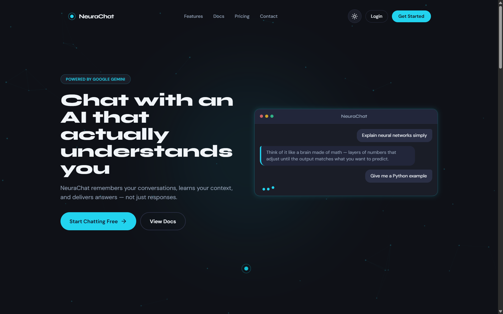
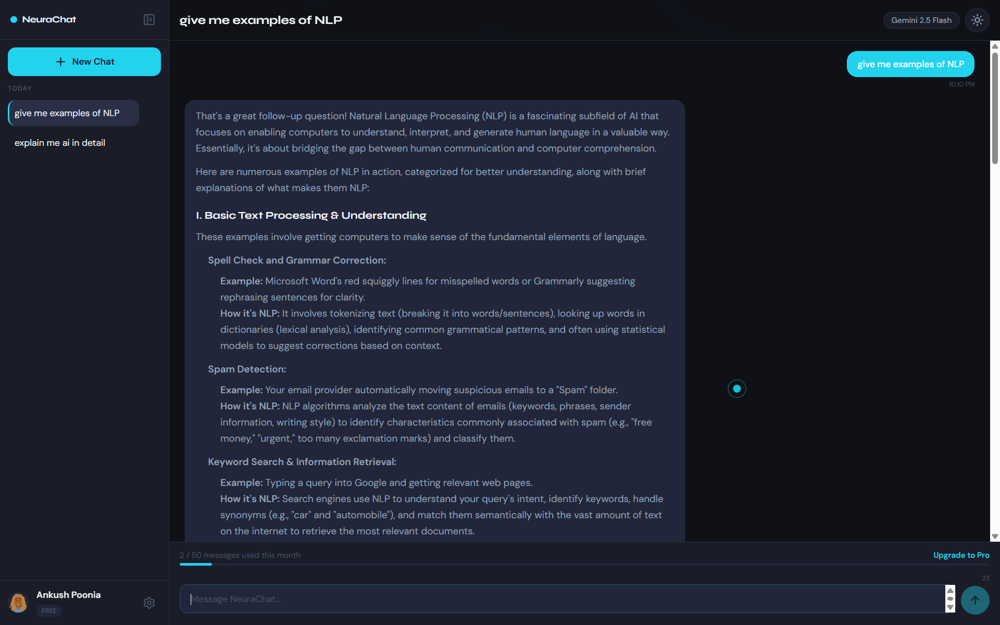

<div align="center">

<!-- BANNER PLACEHOLDER — replace with your actual banner -->


# 🤖 NeuraChat AI
### *An intelligent, context-aware chatbot with agentic reasoning, persistent memory, and a production-grade full-stack web interface.*

[](https://python.org)
[](https://flask.palletsprojects.com)
[](https://deepmind.google/gemini)
[](https://sqlite.org)
[](https://tailwindcss.com)
[](LICENSE)

**[🌐 Live Demo](https://ai-chatbot-agentic-ai-nlp.onrender.com)** &nbsp;•&nbsp; **[📂 Repository](https://github.com/ankush-poonia007/AI-Chatbot-Agentic-AI-NLP)** &nbsp;•&nbsp; **[🐛 Report Bug](https://github.com/ankush-poonia007/AI-Chatbot-Agentic-AI-NLP/issues)**

</div>

---

## 📌 Table of Contents

- [Overview](#-overview)
- [Why I Built This](#-why-i-built-this)
- [How It Works](#-how-it-works)
- [The Process](#-the-process)
- [Project Structure](#-project-structure)
- [Features](#-features)
- [Frontend](#-frontend)
- [Tech Stack & Skills](#-tech-stack--skills-demonstrated)
- [Timeline](#-timeline)
- [Current Status](#-current-status)
- [Vibe Coding & AI Collaboration](#-vibe-coding--ai-collaboration)
- [AI Collaboration Review](#-ai-collaboration-review)
- [Installation & Usage](#-installation--usage)
- [Contributing & Credits](#-contributing--credits)

---

## 🧠 Overview

NeuraChat AI is a **third-generation agentic chatbot** built from scratch with a modular Python backend, a normalized SQLite database, and a multi-page web frontend with a shared design system, dark/light themes, and a dedicated chat workspace.

It goes beyond a simple API wrapper — it **reasons** about user intent and topic before a single token is sent to the LLM. A custom NLP routing layer detects intent (greeting, definition, follow-up, reset, exit) and topic (AI, ML, DL, Neural Networks), then builds a structured, context-enriched prompt for Gemini 2.5 Flash. The result is sharper, more relevant responses with genuine conversational memory.

Users can register, log in, manage multiple independent chat sessions, view persistent history, update their profile, and are subject to a plan-based message limit system — all backed by a production-quality relational schema.
---
> ## 📸 Screenshots

- **Home Page**

- **Chat**

---


## 💡 Why I Built This

Most AI chatbot tutorials hand you a wrapper around an API and call it a day. I wanted to build something that actually **thinks before it speaks**.

The real question I was exploring: *what makes a chatbot genuinely intelligent?* The answer isn't just a better model — it's the layer between the user and the model. Intent detection, topic memory, conversation depth management, and structured prompting. I wanted to design and own that layer myself.

Beyond the technical challenge, this is a **portfolio-grade full-stack project** that demonstrates I can architect, build, and ship a complete AI application — not just run a notebook.

---

## ⚙️ How It Works

```
User Input
    │
    ▼
Intent Detection  →  GREETING / ASK_DEFINITION / FOLLOW_UP / RESET / EXIT / UNKNOWN
    │
    ▼
Topic Detection   →  AI / ML / DL / Neural Networks
    │
    ▼
Memory Manager    →  last_intent / last_topic / last_depth (in-session state)
    │
    ▼
Engine Brain      →  routing logic, depth resolution, topic switching
    │
    ▼
Agent             →  structured prompt + full conversation history injected
    │
    ▼
Gemini 2.5 Flash  →  generates response
    │
    ▼
SQLite            →  both messages saved with role + timestamp
    │
    ▼
Frontend          →  response rendered in chat UI
```

**The agentic differentiator:** Gemini never receives raw user input. It receives a structured prompt built from intent + topic + depth + full conversation history — making it genuinely context-aware across every turn of the session.

---

## 🔨 The Process

### V1 — Terminal Prototype
Built a working terminal chatbot with basic intent detection and Gemini integration. Proved the core concept before touching any frontend or database.

### V2 — Modular NLP Refactor
Separated every concern into its own module: `intent_detection.py`, `topic_detection.py`, `memory_manager.py`, `engine.py`, `agent.py`. Added follow-up handling, topic switching, and explanation depth detection (BASIC vs DETAILED). Entire NLP layer written independently.

### V3 — Full Stack Web Application *(current)*
Complete rebuild around a Flask API backend:
- Designed a normalized 5-table SQLite schema with foreign keys, performance indexes, and an auto-trigger
- Built secure auth with hashed passwords (scrypt via Werkzeug) and Flask sessions
- Implemented multi-session chat with persistent history and Gemini context injection
- Added profile management and a plan-based membership system
- Connected a multi-page frontend served directly through Flask (no separate build step)
- Rebuilt core pages (home, chat, login, register) with a modular JS/CSS architecture, GSAP animations, markdown rendering, and Render deployment

---

## 📁 Project Structure

```
AI-Chatbot-Agentic-AI-NLP/
│
├── backend/
│   ├── database.py              # SQLite connection, init_db(), get_db(), generate_id()
│   ├── auth.py                  # register_user(), login_user()
│   ├── chat.py                  # Chat room + message CRUD, rename, soft delete
│   ├── profile.py               # get_profile(), update_profile()
│   ├── membership.py            # Plan limits, message counting, upgrade
│   │
│   ├── chatbot_engine/
│   │   ├── engine.py            # Central brain() — full intent/topic/depth routing
│   │   └── agent.py             # Gemini API call with history injection
│   │
│   ├── memory/
│   │   └── memory_manager.py    # In-session memory dict + update/reset helpers
│   │
│   └── nlp/
│       ├── intent_detection.py  # Classifies user intent from raw input
│       └── topic_detection.py   # Identifies AI/ML/DL/NLP topic
│
├── database/
│   ├── schema.sql               # Normalized schema: 5 tables, 2 indexes, 1 trigger
│   └── neurachat.db             # Auto-generated on first run (gitignored)
│
├── frontend/
│   ├── html/
│   │   ├── index.html           # Landing — hero, features, pricing, FAQ
│   │   ├── chat.html            # Chat workspace (auth-protected)
│   │   ├── login.html           # Sign in
│   │   ├── register.html        # Sign up
│   │   ├── profile.html         # User profile
│   │   ├── docs.html            # In-app documentation
│   │   ├── contact.html         # Contact form
│   │   ├── terms.html           # Terms of service
│   │   └── recovery.html        # Password recovery (UI placeholder)
│   │
│   ├── css/
│   │   ├── main.css             # Design tokens, base styles, shared utilities
│   │   ├── animations.css       # Keyframes and motion utilities
│   │   ├── chat.css             # Chat layout, sidebar, message bubbles
│   │   ├── index.css            # Legacy page-specific styles
│   │   ├── login.css
│   │   ├── profile.css
│   │   ├── docs.css
│   │   ├── contact.css
│   │   └── terms.css
│   │
│   ├── js/
│   │   ├── nav.js               # Shared navbar (injected on marketing pages)
│   │   ├── theme.js             # Dark/light toggle + localStorage
│   │   ├── cursor.js            # Custom cursor glow
│   │   ├── animations.js        # GSAP page load, ScrollTrigger, particles
│   │   ├── toast.js             # Global toast notifications
│   │   ├── protect.js           # Auth guard — redirects unauthenticated users
│   │   ├── preloader.js         # Page preloader fade-in
│   │   ├── chat.js              # Chat UI — sessions, messages, markdown, limits
│   │   ├── auth.js              # Login + register forms and API calls
│   │   ├── tailwind-config.js   # Tailwind config for legacy pages
│   │   └── script.js            # Legacy contact-page logic
│   │
│   └── static/
│       └── assets/
│           ├── favicon.png
│           └── og-image.png     # Open Graph preview image
│
├── docs/
│   └── PROJECT_FLOW.md          # Architecture and API flow notes
│
├── screenshots/                 # README screenshots
├── app.py                       # Flask app — API routes + static/HTML serving
├── main.py                      # Terminal version (V1/V2 legacy)
├── render.yaml                  # Render.com deployment config
├── .env                         # API keys (gitignored)
├── requirements.txt
└── README.md
```

---

## ✨ Features

### AI & Backend
| Feature | Description |
|---|---|
| Custom NLP routing | Intent + topic detection before every LLM call |
| Gemini 2.5 Flash | Structured prompts with full conversation history |
| User auth | Registration, login, scrypt-hashed passwords, Flask sessions |
| Multi-session chat | Create, rename, and soft-delete independent chat rooms |
| Persistent history | All messages stored in SQLite with roles and timestamps |
| Profile API | Display name, bio, and avatar URL |
| Membership tiers | Basic (50 msgs) vs Pro (unlimited) with server-side enforcement |
| Relational schema | 5 tables, foreign keys, indexes, and an auto-update trigger |

### Frontend & UX
| Feature | Description |
|---|---|
| Landing page | Hero, feature grid, pricing, FAQ, and CTA sections |
| Chat workspace | Sidebar session list, collapsible layout, mobile drawer |
| Markdown replies | `marked.js` rendering with `DOMPurify` sanitization |
| Dark / light theme | Toggle with `localStorage` persistence across pages |
| GSAP animations | Page load, scroll reveals, message transitions |
| Toast notifications | Global success/error feedback |
| Auth guard | Protected chat route redirects unauthenticated users |
| Register flow | Dedicated sign-up page with client-side validation |
| Shared navbar | Injected via `nav.js` on marketing pages |
| Particle background | Canvas-based ambient effect on core pages |
| Lucide icons | Consistent icon set across rebuilt pages |
| SEO & sharing | Meta tags, favicon, and Open Graph image |
| Responsive chat UI | Mobile sidebar, touch-friendly controls |
| Flask-served static | HTML, CSS, JS, and assets from one server (no CORS setup) |
| Live deployment | Hosted on [Render](https://render.com) via `render.yaml` |

---

## 🎨 Frontend

The frontend is **CDN-based** — no Node.js, no bundler. Tailwind, GSAP, Lucide, and markdown libraries load from CDNs; Flask serves HTML, CSS, and JS directly.

### Pages

| Page | Route | Auth | Notes |
|---|---|---|---|
| Home | `/` | Public | Landing, pricing, FAQ — uses `nav.js` + `animations.js` |
| Chat | `/chat` | Required | Full chat app — `protect.js` + `chat.js` |
| Login | `/login.html` | Public | Session login via `auth.js` |
| Register | `/register.html` | Public | Account creation via `auth.js` |
| Profile | `/profile.html` | Required | Legacy layout (pending rebuild) |
| Docs | `/docs.html` | Public | In-app documentation |
| Contact | `/contact.html` | Public | Contact form |
| Terms | `/terms.html` | Public | Terms of service |
| Recovery | `/recovery.html` | Public | Password recovery UI placeholder |

### Shared modules

| Module | Role |
|---|---|
| `main.css` | CSS variables for dark/light themes, typography, surfaces |
| `animations.css` | Reusable motion classes and keyframes |
| `nav.js` | Injects the top navbar on marketing pages |
| `theme.js` | Theme toggle synced to `localStorage` |
| `toast.js` | `showToast(message, type)` for global feedback |
| `cursor.js` | Accent-colored cursor glow on pointer devices |
| `preloader.js` | Fade-in on initial page load |
| `animations.js` | GSAP hero animations, ScrollTrigger, particle canvas |
| `protect.js` | Redirects to login if no Flask session on protected pages |
| `chat.js` | Session sidebar, send/receive, markdown, plan limits |
| `auth.js` | Login/register forms, validation, API integration |

### Design system

- **Accent:** cyan/teal (`#22d3ee` dark / `#0891b2` light)
- **Fonts:** Syne (headings), DM Sans (body), JetBrains Mono (code)
- **Themes:** `data-theme="dark"` (default) and `data-theme="light"` on `<html>`
- **Layout:** Rounded cards, full-width sections, minimal gradient use — inspired by modern AI product UIs

### Serving (Flask)

```
/              → frontend/html/index.html
/chat          → frontend/html/chat.html
/*.html        → frontend/html/<page>.html
/css/*         → frontend/css/
/js/*          → frontend/js/
/static/*      → frontend/static/
```

---

## 🛠 Tech Stack & Skills Demonstrated

### Backend
| Technology | Purpose |
|---|---|
| Python 3.14 | Core language |
| Flask | REST API + static file serving |
| Flask-CORS | Cross-origin support for API routes |
| SQLite | Relational database |
| Werkzeug | Password hashing (scrypt) |
| google-genai | Gemini 2.5 Flash SDK |
| python-dotenv | Environment variable management |

### Frontend
| Technology | Purpose |
|---|---|
| HTML5 / CSS3 | Semantic markup and custom properties (`main.css` design system) |
| Tailwind CSS (CDN) | Utility-first layout — no npm build step |
| Vanilla JavaScript | Modular scripts per concern (`chat.js`, `auth.js`, `nav.js`, …) |
| GSAP + ScrollTrigger | Page animations and scroll-driven reveals |
| marked.js + DOMPurify | Safe markdown rendering in chat bubbles |
| Lucide Icons | SVG icon set via CDN |
| Syne / DM Sans / JetBrains Mono | Display, body, and code typography |
| Flask static routes | `/css/`, `/js/`, `/static/` served from `app.py` |

### Skills Demonstrated
- Modular backend architecture
- Custom NLP routing layer design
- Relational DB schema design (normalization, triggers, indexes)
- REST API design with session-based authentication
- Full-stack integration (Flask serves API + frontend from one app)
- Modular vanilla JS frontend (no framework, no build pipeline)
- Prompt engineering with structured context injection
- Secure credential handling and sanitized markdown output
- Cloud deployment (Render)

---

## ⏱ Timeline

| Phase | Duration |
|---|---|
| V1 — Terminal prototype | ~3 day |
| V2 — Modular NLP refactor | ~5 days |
| V3 — Full stack build | ~7 days |
| **Total** | **~15 days** |

---

## 📊 Current Status

**V3 is complete and deployed.** Backend, database, agentic engine, and core user flows work end-to-end. The app is live on Render.

| Area | Status |
|---|---|
| Backend API & NLP engine | ✅ Complete |
| Auth, chat, profile, membership | ✅ Complete |
| Core frontend (home, chat, login, register) | ✅ Rebuilt with new design system |
| Secondary pages (profile, docs, contact, terms, recovery) | 🔄 Legacy UI — scheduled for design-system alignment |
| Production deployment | ✅ [Live on Render](https://ai-chatbot-agentic-ai-nlp.onrender.com) |

### Known Issues (being polished)
- Secondary pages still use the older glassmorphism layout and relative asset paths
- Minor chat UI edge cases on very small viewports

### Roadmap — V4
- [ ] Align profile, docs, contact, and terms with the new design system
- [ ] RAG with ChromaDB or FAISS
- [ ] Real-time streaming responses (SSE)
- [ ] Admin dashboard
- [ ] OAuth login (Google)

---

## 🤝 Vibe Coding & AI Collaboration

This project was built using a **structured vibe coding approach** — AI tools (Claude by Anthropic) were used as a senior pair programmer, not as a code generator.

**What this looked like in practice:**
- I designed the architecture, schema, and module boundaries
- I made every major technical decision (Flask vs FastAPI, SQLite vs MySQL, session vs JWT)
- AI helped me move faster — explaining tradeoffs, catching bugs, and writing boilerplate I had already understood conceptually
- I reviewed and understood every line before it entered the codebase

The entire NLP routing layer (`engine.py`, `intent_detection.py`, `topic_detection.py`) was designed and written by me across V1 and V2 — before any AI collaboration on V3.

**The skill being demonstrated here isn't just coding.** It's knowing how to leverage AI tools effectively, efficiently, and without losing ownership of the work. In 2025, that's a real industry skill.

---

## 🔍 AI Collaboration Review

*A 100% honest assessment of the Claude ↔ Ankush collaboration during this build.*

### ✅ What worked well
- **Block-by-block code delivery** with explanations before writing — kept me in control
- **Concise, targeted debugging** — paste an error, get the exact fix with the reason
- **Decision checkpoints** — major choices were discussed, not assumed
- **Scope management** — flagged a 15-table schema as overkill, recommended a clean 5-table version that was the right call
- **Consistent context** — remembered the full project structure across the session

### ⚠️ What could be improved
- **Occasional typos in generated code** (`get_jason`, `get_id`, `method` vs `methods`, missing `/` in routes) — small but added debug cycles
- **Import path errors** — wrong paths given a few times, requiring correction after errors appeared
- **Windows-specific gaps** — curl commands given in Linux syntax first, causing friction on PowerShell/CMD

### 🏆 Overall
Genuinely useful collaboration. The key was coming in with a clear plan and using AI to accelerate execution — not to replace thinking. The dynamic felt like working with a fast, knowledgeable senior dev who occasionally makes typos and always explains their reasoning.

**Collaboration rating: 8.5 / 10**

---

## 🚀 Installation & Usage

### Prerequisites
- Python 3.10+
- A [Google Gemini API key](https://aistudio.google.com/app/apikey)

### Setup

```bash
# 1. Clone the repository
git clone https://github.com/ankush-poonia007/AI-Chatbot-Agentic-AI-NLP.git
cd AI-Chatbot-Agentic-AI-NLP

# 2. Install dependencies
pip install -r requirements.txt

# 3. Create your .env file
echo GEMINI_API_KEY=your_key_here > .env

# 4. Run the app
python app.py
```

### Access
```
http://127.0.0.1:5000
```

### API Reference

| Method | Endpoint | Auth | Description |
|---|---|---|---|
| POST | `/api/register` | ❌ | Register new user |
| POST | `/api/login` | ❌ | Login |
| POST | `/logout` | ✅ | Logout |
| GET | `/api/profile` | ✅ | Get profile |
| POST | `/api/profile/update` | ✅ | Update profile |
| POST | `/api/chats/new` | ✅ | Create chat session |
| GET | `/api/chats` | ✅ | List all chats |
| GET | `/api/chats/<id>/messages` | ✅ | Get chat history |
| POST | `/api/chats/<id>/rename` | ✅ | Rename chat |
| POST | `/api/chats/<id>/delete` | ✅ | Soft delete chat |
| POST | `/api/chat` | ✅ | Send message |

---

## 🤝 Contributing & Credits

**Built by:** [Ankush Poonia](https://github.com/ankush-poonia007) — 2nd year B.Tech AI/ML Engineering, Arya College of Engineering, Jaipur.  
**LinkedIn:** [Ankush Poonia](https://www.linkedin.com/in/ankush-poonia007/)

**AI Pair Programmer:** Claude (Anthropic) — used for accelerated development, debugging, and review during V3.

### Contributing
```bash
# 1. Fork the repo
# 2. Create your feature branch
git checkout -b feature/your-feature

# 3. Commit your changes
git commit -m "Add your feature"

# 4. Push and open a Pull Request
git push origin feature/your-feature
```

Found a bug? [Open an issue](https://github.com/ankush-poonia007/AI-Chatbot-Agentic-AI-NLP/issues) with steps to reproduce.

---

<div align="center">

**MIT License** — free to use, modify, and distribute with attribution.

Made with 🧠 + ☕ by Ankush Poonia

⭐ *If this project helped you or impressed you, a star means a lot!*

</div>